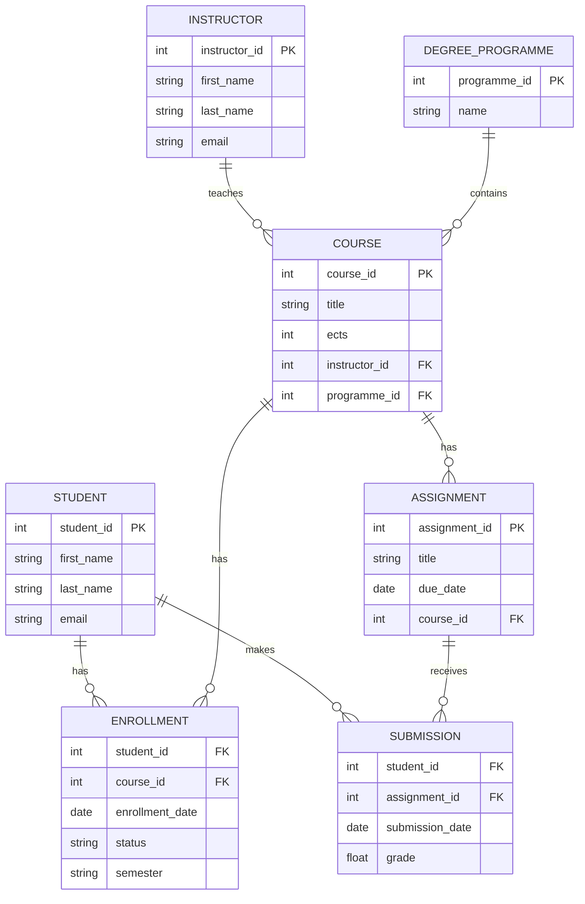

```mermaid
erDiagram
    STUDENT ||--o{ ENROLLMENT : has
    COURSE ||--o{ ENROLLMENT : has
    INSTRUCTOR ||--o{ COURSE : teaches
    DEGREE_PROGRAMME ||--o{ COURSE : contains
    COURSE ||--o{ ASSIGNMENT : has
    STUDENT ||--o{ SUBMISSION : makes
    ASSIGNMENT ||--o{ SUBMISSION : receives

    STUDENT {
        int student_id PK
        string first_name
        string last_name
        string email
    }

    INSTRUCTOR {
        int instructor_id PK
        string first_name
        string last_name
        string email
    }

    DEGREE_PROGRAMME {
        int programme_id PK
        string name
    }

    COURSE {
        int course_id PK
        string title
        int ects
        int instructor_id FK
        int programme_id FK
    }

    ENROLLMENT {
        int student_id FK
        int course_id FK
        date enrollment_date
        string status
        string semester
    }

    ASSIGNMENT {
        int assignment_id PK
        string title
        date due_date
        int course_id FK
    }

    SUBMISSION {
        int student_id FK
        int assignment_id FK
        date submission_date
        float grade
    }


```